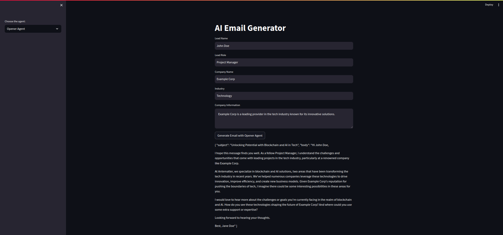
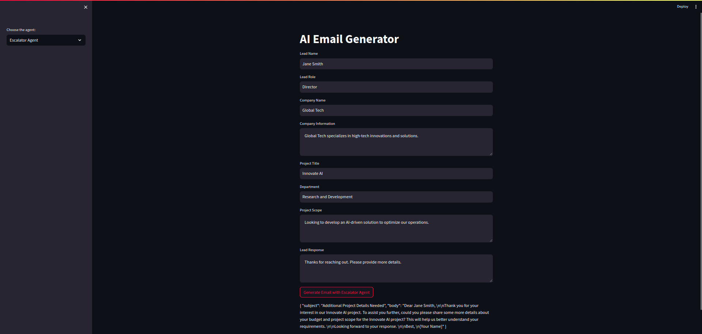
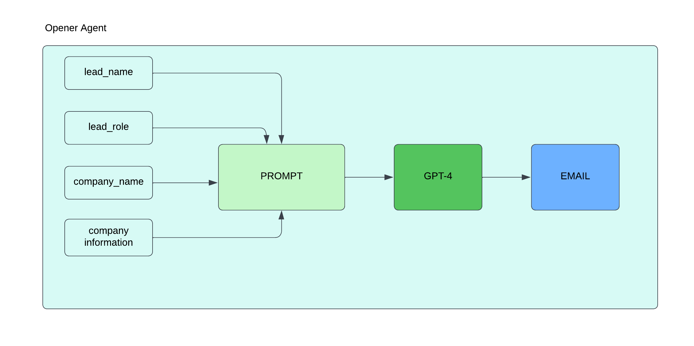
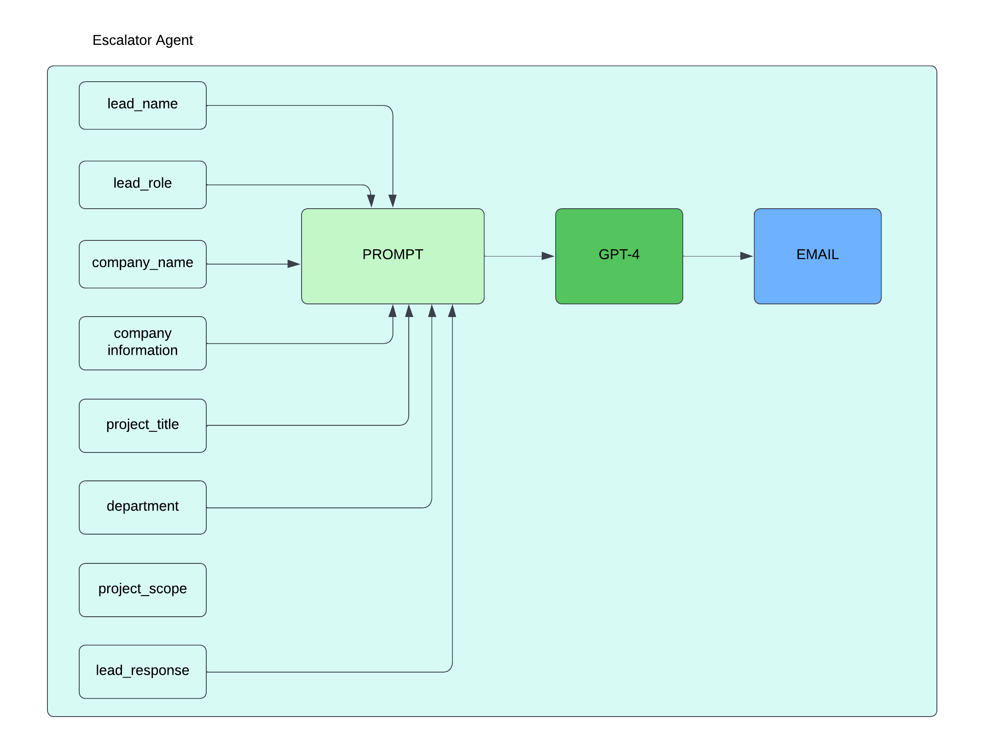

# EchoSale




In this project I am building Opener and Escalator agent that will assist Antematter's sales department. Here is the description about the two agents that I am going 

## Opener Agent
The Opener Agent is responsible for generating personalized cold emails to potential leads with the goal of enticing them to choose Antematter as their software consultancy provider. The agent should follow these guidelines:

1. Personalized Emails: The emails should be personalized for each lead.
2. Inquire about Details: The email should inquire about the scope and budget the lead has in mind.
3. Length and Format: The email should have a brief subject (less than 30 characters) and a body no longer than three paragraphs.
4. Tone: The tone of the email should be human and not mechanical.
5. Language: The email should not use flowery or flattering language.
6. Data Storage: Store all inputs and outputs of the agent in a CSV file, including Model Name, Temperature, Lead information, Prompt, Email Subject, and Email Body.


## Escalator Agent
The Escalator Agent is responsible for handling the responses from the leads and taking appropriate actions based on the information provided. The agent should follow these guidelines:

1. Escalate with Budget and Scope: If the lead provides information about the budget and project scope, escalate the lead to the admin.
2. Request Missing Details: If no information is available for either budget, scope, or both, prompt the user to provide the missing details.
3. Escalate for More Information: If the user requests more information, escalate the lead to the admin.

The goal of these agents is to streamline the sales process by generating personalized emails and handling lead responses autonomously, ultimately escalating qualified leads to the admin for further action.

## Opener Agent Architecture



## Escalator Agent Architecture



## Steps to Run the Code
1. Create a virtual Environment

```bash
        conda create -n echosale_env python=3.10
```

2. I have added all the dependencies in the file requirements.txt run this command to install all the requirements.

```bash
        pip install -r requirements.txt
```

3. Create a new file .env and place OPENAI_API_KEY their.

```bash
    OPENAI_API_KEY="Your_OPENAI_API_KEY"
```

3. Now run the streamlit application.

```bash
        streamlit run app.py
```